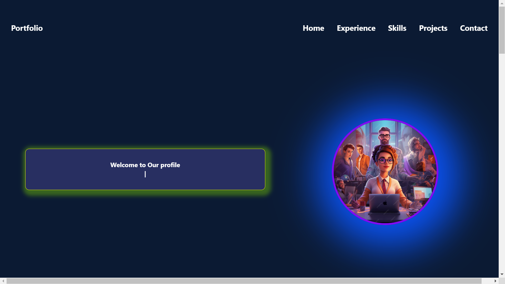

# Project Name : One Page Portfolio

## Description


### 🔗 **Live Project Link**  
[Live Demo](https://curious-pithivier-5a7b0c.netlify.app/)  

### 🛠 **Technologies Used**  
- React  
- Vite  
- Tailwind CSS  
- Node.js (if applicable)  
- Firebase (if applicable)  
- Other technologies you used

---

## README Content

### 📌 **Project Overview**

This project is my personal **portfolio website**, designed to showcase my skills, projects, and achievements as a **front-end developer**. It's built using **React** and **Tailwind CSS**, offering a sleek and responsive design that ensures a smooth browsing experience across all devices.

The portfolio is a one-stop place for potential employers, collaborators, or clients to explore my work, contact me, and get to know more about my expertise in web development.


<!-- ### 📸 **Screenshot** *(If available, insert a clean screenshot here)*   -->


---

### 🛠 **Main Technologies Used**  
- **Frontend:** React, Vite, Tailwind CSS  
- **Backend:** Node.js, Firebase (if applicable)  
- **Tools:** Git, Postman, Visual Studio Code, etc.  

---

### 4. Core Features
- **Responsive Design**: The website adjusts its layout for different screen sizes using Tailwind CSS.
- **Interactive UI**: Dynamic buttons, forms, and modals powered by React.
- **State Management**: Utilizes React's useState and Context API for handling component states.
- **Search Functionality**: Users can search and filter through a list of items.
- **Error Handling**: Displays error messages and feedback for users.
- **Theming**: Includes dark mode/light mode toggle.
- **Page Routing**: Smooth navigation between pages using React Router.
- **UI/UX Integration**: Designed with user-friendliness in mind for a seamless experience.

---

### 🚀 **How to Run the Project Locally**

1️⃣ **Clone the repository:**  
```bash
git clone https://github.com/jasminaramim/one-page-portfolio.git
```

2️⃣ **Navigate to the project folder:**  
```bash
cd project-name
```

3️⃣ **Install dependencies:**  
```bash
npm install
```

4️⃣ **Start the development server:**  
```bash
npm run dev
```

5️⃣ **Open in your browser:**  
```bash
http://localhost:5173
```

---

### 📚 **Live Project Links & Other Resources**  
<!-- - [Project Documentation](link-to-documentation) -->
- [Live Demo](https://curious-pithivier-5a7b0c.netlify.app/)
```

This format includes everything without the dependencies section. You can still customize it based on your project, technologies used, and specific instructions for running the project.
